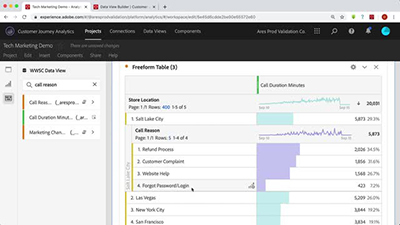

# Zelfstudies voor Customers Journey Analytics

Welkom bij de [!DNL Customer Journey Analytics] Site voor zelfstudies.  Deze zelfstudies samen met de [documentatie](https://experienceleague.adobe.com/docs/analytics-platform/using/cja-landing.html?lang=nl-NL) biedt u een beter inzicht in hoe u Adobe Analytics kunt gebruiken om klanten met meerdere kanalen sneller dan ooit inzicht te geven in uw situatie.  Aan de slag,

* Zie de **&quot;Nieuwe functies&quot;** onderstaande sectie voor de meest recente goodies
* **Personeelspikkels** benadrukt een aantal van onze favoriete inhoud
* Verken de inhoud per onderwerp en subonderwerp in het dialoogvenster **linkernavigatie**
* Gebruik de **zoeken** veld boven aan de pagina als u weet waarnaar u zoekt

Met Customer Journey Analytics kunt u bepalen hoe u online en offline gegevens in Analysis Workspace verbindt met een gemeenschappelijke klant-id. U kunt dan eindelijk attributie, segmentatie, stroom, fallout enzovoort uitvoeren. voor de gehele gegevensset van de klant.

## Personeelsselectie

<table>
<tr>
  <td>
    
    

      <a href="visitor-id/understanding-how-customer-journey-analytics-uses-identity.md">
    <strong>Begrijpen hoe de Customer Journey Analytics Identiteit gebruikt</strong>
    </a>
    

    

    <em>Een praktisch overzicht van de invloed van identiteit op uw Customer Journey Analytics</em>
    

  </td>
   <td>
    
    

      <a href="architecture/architecture-and-integrations-of-cja.md">
    <strong>Architectuur en integratie van Customer Journey Analytics</strong>
    </a>
    

    

    <em>Analyse van de architectuur van de Customer Journey Analytics, inclusief integratie met de Adobe Experience Platform.</em>
    

  </td>
  <td>
    
    

      <a href="analysis-workspace/visualizations/cross-channel-attribution-in-customer-journey-analytics.md">
    <strong>Kanaalkenmerk in Customer Journey Analytics</strong>
    </a>
    

    

    <em>Hoe u visualisaties kunt gebruiken om attributie (krediet) over kanalen te tonen.</em>
    

  </td>
</tr>
</table>

